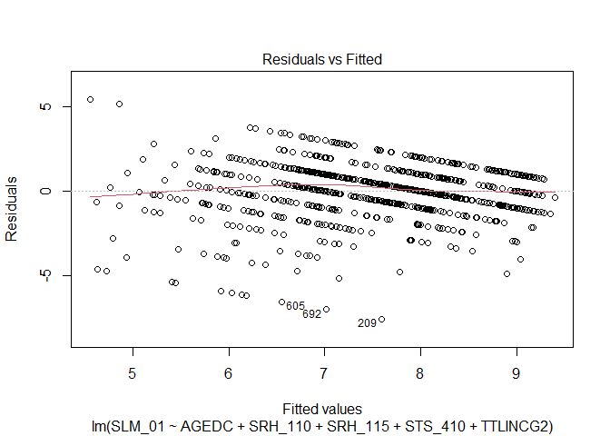
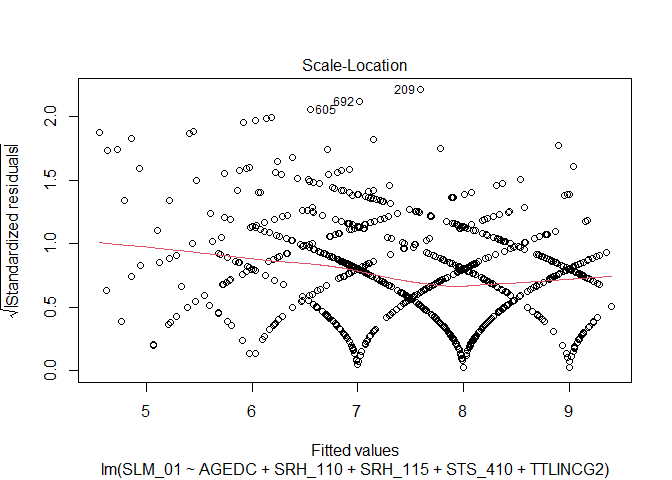
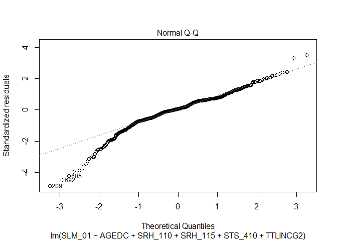
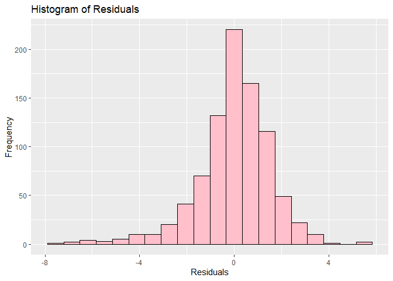

Reproducing Code: Report
================
Kamila Kolpashnikova
2022-10-07

## Summary

The project was fully reproducible. All outputs and graphs were possible
to replicate. Code was provided, but the program was clear enough to
walk through the same steps.

## Replicator’s Computing Environment

### Software

-   Edition Windows 10 Pro
-   Version 10.0.19044
-   Installed on 4/11/2020
-   R version: 4.2.1 (2022-06-23 ucrt) – “Funny-Looking Kid”

### Hardware

-   Processor Intel(R) Core(TM) i7-10610U CPU @ 1.80GHz 2.30 GHz
-   Installed RAM 32.0 GB
-   System type 64-bit operating system, x64-based processor

## Replication Steps

1.  Load necessary packages into R (readr, tidyverse, ggplot2) and
    import ‘gss_12M0025_E\_2017_c\_31_F1.csv’
2.  Create table of interest from main GSS using variables:

-   decimal age (AGEDC),
-   subjective well-being (SLM_01),
-   self-rated health (SRH_110),
-   self-rated mental health (SRH_115),
-   satisfaction with time spent with children (STS_410),
-   and total personal income (TTLINCG2).

3.  Clean this data

<!-- -->

1.  Drop skipped answers (values 96-99) from subjective well-being
    (SLM_01)
2.  Drop skipped answers (values 6-9) from self-rated health (SRH_110)
3.  Drop skipped answers (values 6-9) from self-rated mental health
    (SRH_115)
4.  Drop skipped answers (values 6-9) from satisfaction with time spent
    with children (STS_410)

``` r
gss <- read.csv('data/gss-12M0025-E-2017-c-31_F1.csv') %>%
  select(c(PUMFID, AGEDC, SLM_01, SRH_110, SRH_115, 
           STS_410, TTLINCG2, WGHT_PER)) %>% 
  filter(SLM_01 < 96, SRH_110 < 6, SRH_115 < 6, STS_410 < 6)
```

4.  Create a basic linear regression model estimating subjective
    well-being using the other 5 variables and note coefficients,
    significant variables, and R-sq

``` r
model <- lm(SLM_01 ~ AGEDC + SRH_110 + SRH_115 + STS_410 + TTLINCG2, data = gss)
summary(model)
```

    ## 
    ## Call:
    ## lm(formula = SLM_01 ~ AGEDC + SRH_110 + SRH_115 + STS_410 + TTLINCG2, 
    ##     data = gss)
    ## 
    ## Residuals:
    ##     Min      1Q  Median      3Q     Max 
    ## -7.5917 -0.7905  0.0992  0.9814  5.4505 
    ## 
    ## Coefficients:
    ##              Estimate Std. Error t value Pr(>|t|)    
    ## (Intercept) 10.428621   0.321343  32.453  < 2e-16 ***
    ## AGEDC       -0.008058   0.006569  -1.227  0.22032    
    ## SRH_110     -0.252748   0.062639  -4.035 5.94e-05 ***
    ## SRH_115     -0.771763   0.061867 -12.474  < 2e-16 ***
    ## STS_410     -0.162582   0.059382  -2.738  0.00631 ** 
    ## TTLINCG2     0.073869   0.042962   1.719  0.08590 .  
    ## ---
    ## Signif. codes:  0 '***' 0.001 '**' 0.01 '*' 0.05 '.' 0.1 ' ' 1
    ## 
    ## Residual standard error: 1.561 on 877 degrees of freedom
    ## Multiple R-squared:  0.2973, Adjusted R-squared:  0.2933 
    ## F-statistic: 74.22 on 5 and 877 DF,  p-value: < 2.2e-16

5.  Check assumptions of the model (Independence can be assumed):

<!-- -->

1.  Linearity assumption: isolate the first graph of the plot function

<!-- -->

2.  Equal variance assumption: isolate the third graph of the plot
    function

<!-- -->

3.  Normality assumption: plot(model, which=2)
    <!-- -->

4.  Isolate the second graph of the plot function

<!-- -->

2.  Create a basic histogram of residuals with 20 bins, pink bars with
    black outlines, and appropriate title/axis labels

<!-- -->

## Code Testing Summary

| Figure or Table | Relevant program | Replicated (comments) |
|-----------------|------------------|-----------------------|
| Output 1        | code.R           | Yes                   |
| Figure 1        | code.R           | Yes                   |
| Figure 2        | code.R           | Yes                   |
| Figure 3        | code.R           | Yes                   |
| Figure 4        | code.R           | Yes                   |

## Discrepancies

There were no discrepancies observed.

## Classification

Full reproduction.
